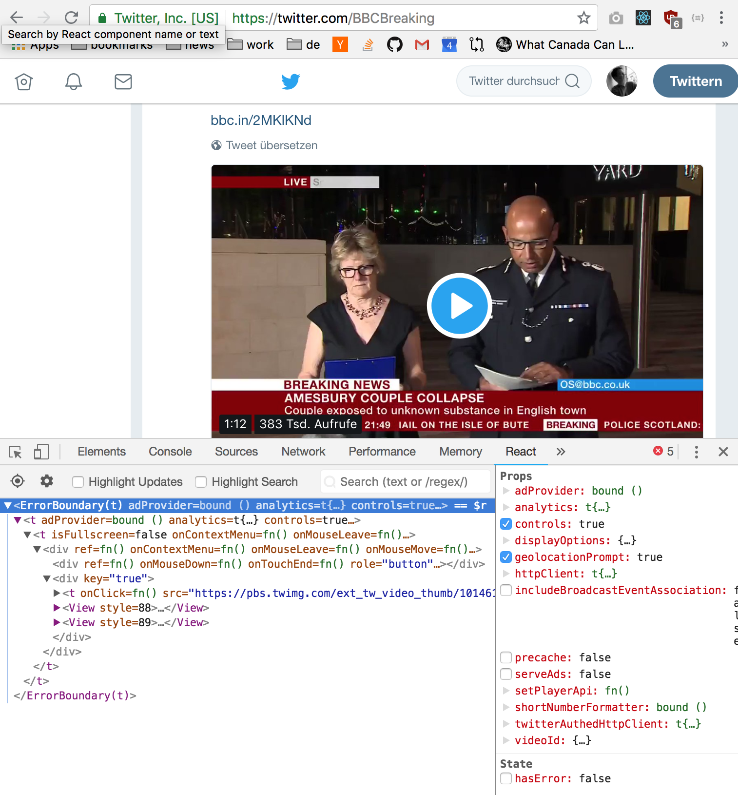

Twitter doesn't use React on their regular desktop site, at least that is what I thought. But today I noticed my React Developer Tool icon in Chrome light up occasionally when browsing Twitter. Twitter load by default 4 .js files, some of these might be translation files. They take up a 500KB when compressed. Now, React version 16.2.0 won't load unless you have a video element in the stream. When you scroll to a video element Twitter loads additionally 5 files and the React Developer icon will light up. These 5 compressed files takes up 280KB (they could be minimized for production too). This looks like this:



A few code snippets from the loaded javascript files:

```javascript
la.injectIntoDevTools({
  findFiberByHostInstance: w,
  bundleType: 0,
  version: '16.2.0',
  rendererPackageName: 'react-dom',
})
```

```javascript
function I(e) {
    L = e.getFiberCurrentPropsFromNode, N = e.getInstanceFromNode, D = e.getNodeFromInstance
  }
  /** @license React v16.2.0
```
